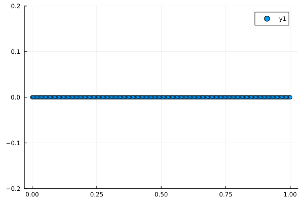
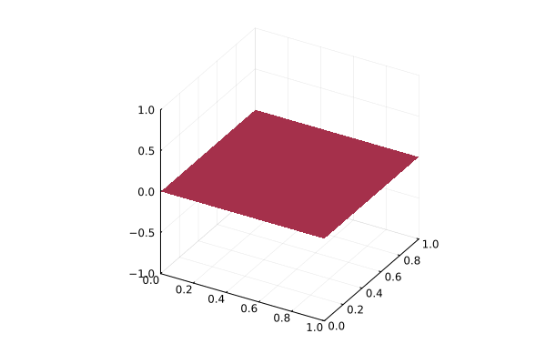

# JuliaWaveEqn
This code creates 1D and 2D wave simulations. It is capable of modelling driving forces, interference and reflection.
Here is a one dimensional wave that is being driven by an oscillating force on one end.

A heatmap visualisation of the collapse of a gaussian initial condition.

A heightmap showing a wave driven at resonant frequency.

